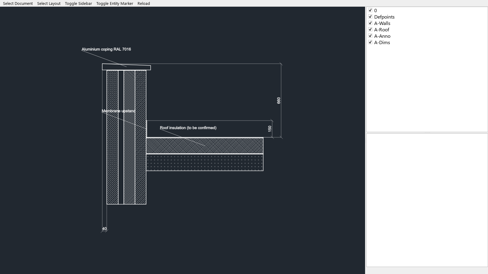
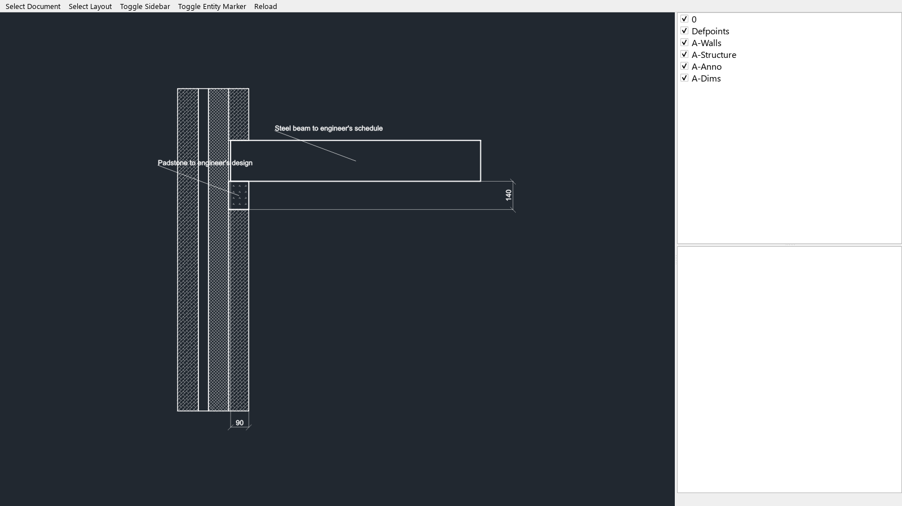

# Prompt 5 verification — 28 September 2026

Base: `render-interfaces` at `f6d2623`. Python 3.12.14 on Windows,
ezdxf 1.4.4, Cairo via pycairo 1.29.1, Pillow 12.3.0.

## Examiner gate

```sh
python -m pytest fixtures/render/tests \
  --ignore=fixtures/render/tests/test_stills.py \
  --ignore=fixtures/render/tests/test_preview_video.py -p no:cacheprovider
```

**303 passed.** `python fixtures/render/scripts/build.py --check` also passes:
70 generated files are current, covering 13 detail types and the Idea variant.
The builder validates all 14 DDL drawings using the actual core validator.

Claude Code corrected the duplicate IDs and annotation text extraction in
`f6d2623` ([issue #12](https://github.com/Akomzy1/drawlogic/issues/12)). This
implementation is rebased onto those examiner changes; no renderer changes were
needed to pass the corrected gate.

The prerequisite checks pass: 17 core solver cases and 25 profile cases. Ruff and
strict mypy pass for the engine.

## Actual DXF opened in a reference viewer

The unmodified [ezdxf CAD viewer](https://ezdxf.readthedocs.io/en/stable/launcher.html#view)
loaded both exported DXFs from disk. Both audits reported zero errors and zero
repairs. The screenshots below are Qt widget captures of that viewer using
PySide6-Essentials 6.10.2 with the offscreen platform; they are not screenshots of
Drawlogic's SVG renderer. The layer list, real dimension blocks, annotation
leaders and profile hatches are visible.





To reproduce interactively, install the viewer's Qt dependency and run:

```sh
ezdxf view docs/evidence/prompt5/parapet.dxf
ezdxf view docs/evidence/prompt5/steel_beam_bearing.dxf
```

## Other outputs and repeatability

Each detail has its original SVG, DXF and PDF export, three conditioning PNGs and
an artefacts metadata JSON. PDF preview PNGs were rendered from the exported PDF
with PDFium (pypdfium2 5.13.0) and visually inspected. The blank box at the bottom
right is the reserved stamp area. Annotation positions come from the fixture DDL.

All four routes were called for all 13 detail types under both `gb-eng` and
`variant` conventions in two complete runs, separated by more than one second.
All 104 response pairs were byte-identical.
[determinism.json](determinism.json) records their SHA256
digests. Concept DXF rejection, malformed JSON, missing request fields and the
shared health route were also checked manually. These smoke checks supplement
the independent examiner gate.
