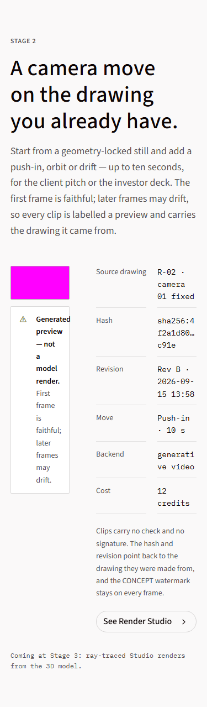
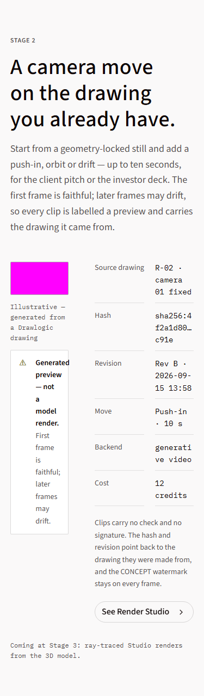
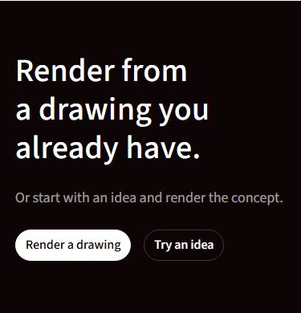
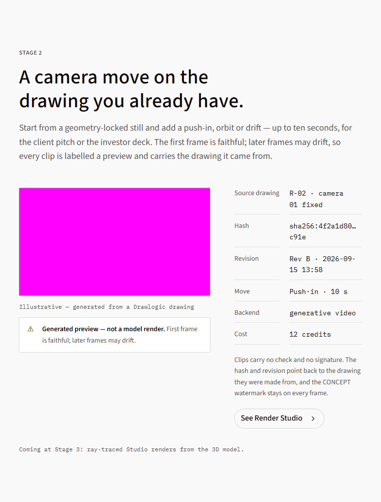
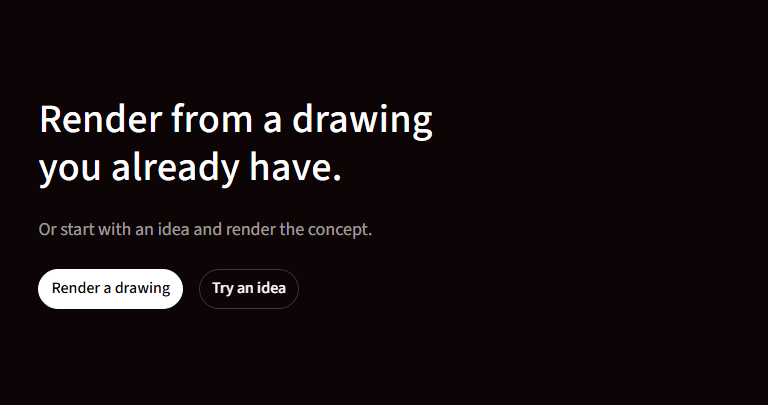
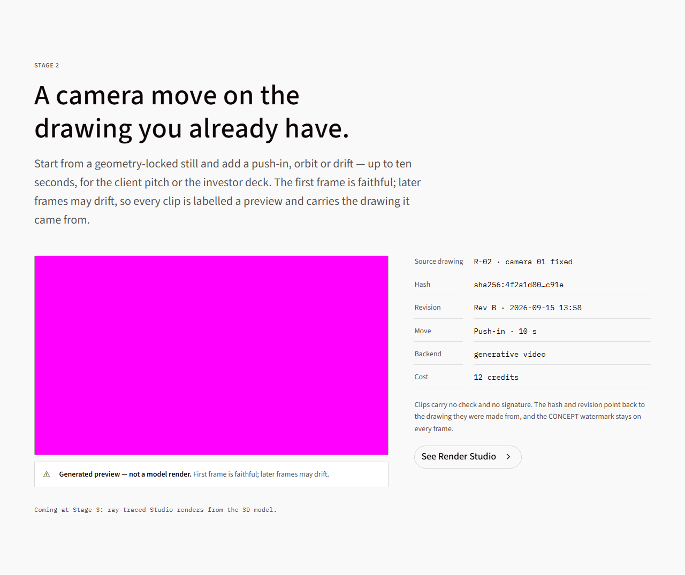
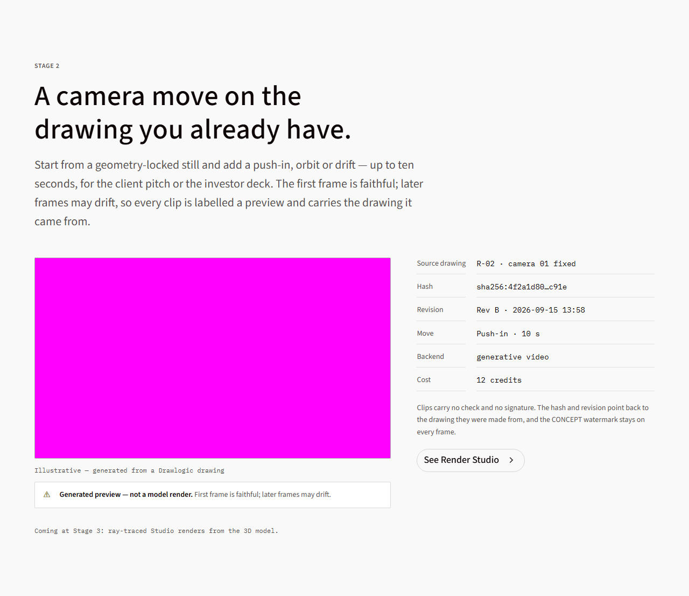

# Issue #17: site fidelity follow-up

Prototype: `design/prototype/marketing-site.html` (SHA256 `7786fc5f65e7…`).
Examiner PR #20 was merged before these changes. No examiner files were edited.

## Changes

1. Horizontal plan prices, interpretation tables, standards reports, code examples,
   and the plan comparison have `tabIndex=0`, a region role and an accessible name.
   The existing `:focus-visible` rule supplies the token-based focus outline.
2. The preview retains the prototype's three Concept watermark repeats and its
   Concept PDF/PNG strip. One repeat is accessible; the other two are decorative.
3. The complete preview-and-drift sentence is unchanged. The Illustrative caption
   is a separate paragraph.
4. The final Render studio section uses the prototype's static `CTA` component.
   No scroll listener or animation exists on this section. After restoring the
   preview layout, the examiner's unchanged motion check passes. Two viewport
   captures 120 px apart also have identical overlapping section pixels.

Caption bands, contrast corrections and the 2% visual budget remain unchanged.
Those visual differences await the design re-export recorded in DESIGN_GAPS.

## Side-by-side evidence

Each pair shows the approved prototype on the left and the current site on the
right. Video is masked by the examiner's existing screenshot helper. These are
review artifacts; they do not replace the examiner's visual baselines.

| Width / section | Prototype | Site |
|---|---|---|
| 375 / preview |  |  |
| 375 / final |  |  |
| 768 / preview |  |  |
| 768 / final |  |  |
| 1280 / preview |  |  |
| 1280 / final |  |  |

## Fidelity checklist

- [x] Prototype file named; side-by-side screenshots attached.
- [x] Existing tokens only; build colour guard passes.
- [x] Concept watermark, preview label, caption and keyboard access verified.
- [x] Banned-word checks pass for the affected pages and all shipped text files.
- [x] 375 / 768 / 1280 verified on the final build.
- [x] Gaps recorded in `docs/DESIGN_GAPS.md`.

## Validation results

- `npm run build`: passes token guard, compilation, TypeScript and static export.
- Final targeted examiner run, `--workers=2`: **54 passed, 12 skipped**. This
  includes all 36 axe checks (12 pages at three widths), plus Idea mode and Render
  studio honesty, copy, captions, content-source and banned-word checks. The 12
  skips are the examiner's desktop-only checks at smaller widths.
- Shipped-output banned-word scan: **1 passed**.
- Render studio motion: the full-motion check at 1280 and reduced-motion checks
  at all three widths pass. These ran after the layout fixes, before the final
  accessibility-only watermark change.
- Importing twice produces identical component/content hashes.
- `git diff 06ad68d -- site/tests`: empty.
- Keyboard smoke check at 375: the plan comparison receives focus, ArrowRight
  moves `scrollLeft` from 0 to 40, and the focus outline is the existing blue
  `--focus-ring`, 2px solid.
- The preview has three Concept text nodes. The first is accessible; duplicate
  copies remain decorative. [Unmasked preview](1280-preview-unmasked.png) shows
  the watermark and PDF/PNG strip that the comparison helper's video mask hides.

The full visual suite is left to the independent examiner. Existing differences
from caption bands and contrast corrections remain pending design.

## Optional media check

Warm local `load` measurements: Home 894 ms, Idea mode 794 ms. Neither page
contains video, so neither fetches a video eagerly. Images remain eager as in the
prototype; total transferred resources were approximately 4.51 MB and 4.44 MB.
Lazy loading the off-screen images and later hero slides remains a performance
follow-up. These timings are not Lighthouse scores; CI still owns the >=90
performance gate. No media bytes or loading behaviour changed in this fix.
